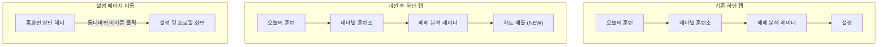
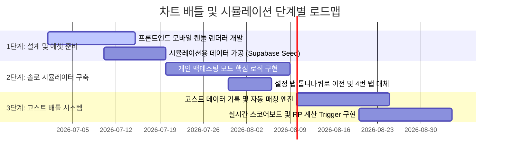

# ChartMon 중장기 고도화 계획 - 백테스팅 시뮬레이션 및 경쟁형 차트 배틀 도입

이 문서는 글로벌 백테스팅 SaaS 서비스인 **FXReplay**를 벤치마킹하여, ChartMon 모바일 앱에 **실전 백테스팅 시뮬레이터**와 **경쟁형 차트 배틀 게임(리그 시스템)**을 연동하기 위한 서비스 기획 및 데이터베이스/아키텍처 설계 초안입니다.

---

## 1. 벤치마킹 분석 (FXReplay & FXR Battle)

[FXReplay](https://fxreplay.com/)는 트레이더들이 과거 차트 데이터를 통해 자신의 기법을 백테스팅할 수 있는 웹 기반 SaaS입니다. 최근 도입된 **FXR Battle(가상매매 경쟁)**은 게임 요소를 극대화하여 트레이더들끼리 동일한 과거 차트 상황을 주고 제한 시간 내에 누적 수익률로 경쟁하는 배틀 시스템입니다.

### ChartMon에 가져올 핵심 가치
- **정적 문제풀이에서 동적 거래 경험으로의 확장**: 단순히 단답형 퀴즈를 푸는 것을 넘어, 과거 특정 구간의 캔들을 흘려보내며 매수(Buy)/매도(Sell) 및 포지션 청산을 실시간/배속으로 결정하는 모뮬레이션 구현.
- **소셜 플레이를 통한 리텐션 확보**: 트레이딩은 본질적으로 외롭고 지루한 훈련입니다. 다른 유저들과 1:1 매칭 혹은 리그전 형태의 "차트 배틀"을 지원하여 자연스러운 게임화(Gamification)와 커뮤니티 활성화를 유도합니다.

---

## 2. 모바일 앱 구조 개편 (하단 탭 바 재배치)

현재 모바일 앱의 4번째 탭인 "설정(Settings)"은 유저의 방문 빈도가 낮고 화면 공간을 낭비하고 있습니다. 이를 숨기고 핵심 핵심 기능 탭으로 대체합니다.



- **설정 페이지 (이전)**: 홈 화면 우측 상단 헤더에 **설정(톱니바퀴) 아이콘**을 작게 배치하여 팝업이나 서브 페이지로 숨김 처리.
- **4번째 탭 (신설)**: **"차트 배틀 (Chart Battle)"** 또는 **"백테스트 챌린지"** 영역으로 선언하여 소셜 대결 및 시뮬레이션 진입점으로 활용.

---

## 3. 핵심 신규 기능 정의

### [기능 A] 백테스팅 시뮬레이션 드릴 (Backtesting Simulation)
정해진 문제와 선택지 대신, 캔들이 자동으로 흘러가는 상황에서 유저가 실시간 매매 판단을 내리는 시뮬레이터입니다.

1. **시뮬레이션 진입**: 훈련소에서 특정 패턴(예: "헤드앤숄더 돌파", "RSI 지표 함정") 팩을 선택하여 시뮬레이션을 시작합니다.
2. **캔들 스트리밍**: 과거 200~300개 캔들 데이터가 배속(예: 0.5초당 1캔들)으로 우측에서 좌측으로 드로잉됩니다. 유저는 일시정지, 배속 조절이 가능합니다.
3. **포지션 진입/청산**:
   - **Buy (롱)** / **Sell (숏)** / **Flat (대기/청산)** 버튼 활성화.
   - 포지션 진입 시 레버리지와 진입 비중(자산 대비 % 등) 선택 가능.
4. **결과 피드백**: 시뮬레이션 종료 시 진입 타점들의 적합도, 손익비(Risk/Reward Ratio), 최대 낙폭(MDD), 최종 누적 수익률을 피드백 리포트로 반환.

### [기능 B] 실시간/비동기 차트 배틀 (Chart Battle)
동일한 익명의 역사적 차트 세트를 두고, 매칭된 두 명의 유저가 경쟁하는 게임 모드입니다.

- **비동기 고스트 배틀 (추천)**: 실시간 동시 접속의 매칭 지연을 피하기 위해, 다른 유저가 플레이한 백테스팅 기록(고스트)을 대상으로 플레이합니다.
- **게임 규칙**:
  - 두 유저에게 **동일한 시작 시점의 차트**가 제공됩니다. (예: 2021년 비트코인 15분봉의 임의 구간)
  - 가상의 자산(예: 10,000 USD)과 제한 시간(예: 3분)이 주어집니다.
  - 시간 동안 자유롭게 가상 매매를 진행하여 최종 수익률이 더 높은 유저가 승리합니다.
- **보상 및 리그 시스템**:
  - 승리 시 상대방의 RP(Rating Point)를 뺏어오며 배틀 랭킹(리그 티어: 브론즈 ~ 챌린저)에 반영됩니다.

---

## 4. 데이터베이스 및 서버 아키텍처 확장 (Supabase)

배틀 상태 및 가상 매매 데이터를 처리하기 위해 기존 테이블 스키마에 아래와 같은 테이블군을 추가 확장할 수 있습니다.

### 신규 테이블 스키마 설계안

#### 1) `battle_rooms` (배틀 매칭 룸)
배틀 매칭 및 진행 상태를 관리합니다.
```sql
create table battle_rooms (
  id uuid default gen_random_uuid() primary key,
  chart_seed_id text not null, -- 대결에 쓰인 캔들 데이터셋 ID
  status text not null default 'matching', -- matching, playing, finished
  created_at timestamp with time zone default timezone('utc'::text, now()) not null
);
```

#### 2) `battle_players` (배틀 참가 유저 정보)
룸에 참가한 플레이어들의 중간 손익 및 상태를 추적합니다.
```sql
create table battle_players (
  id uuid default gen_random_uuid() primary key,
  room_id uuid references battle_rooms(id) on delete cascade not null,
  user_id uuid references auth.users(id) not null,
  initial_balance numeric default 10000.0 not null,
  current_balance numeric default 10000.0 not null,
  is_ghost boolean default false not null, -- 고스트 플레이어 여부
  status text not null default 'ready', -- ready, playing, submitted, disconnected
  score_rp_delta integer, -- 대결 후 갱신된 RP 변동치
  updated_at timestamp with time zone default timezone('utc'::text, now()) not null
);
```

#### 3) `virtual_trades` (가상매매 체결 기록)
배틀이나 시뮬레이션 중 체결된 매매 정보 리스트입니다.
```sql
create table virtual_trades (
  id uuid default gen_random_uuid() primary key,
  player_id uuid references battle_players(id) on delete cascade,
  user_id uuid references auth.users(id), -- 개인 시뮬레이션용일 경우 player_id 대신 참조
  trade_type text not null, -- BUY, SELL
  price numeric not null, -- 체결 가격
  amount numeric not null, -- 체결 수량
  leverage integer default 1 not null,
  candle_index integer not null, -- 대결 차트 데이터 중 몇 번째 캔들에서 진입했는지 기록
  created_at timestamp with time zone default timezone('utc'::text, now()) not null
);
```

---

## 5. 시뮬레이션용 데이터 수급 및 라이선스 회피 전략

백테스팅 및 실시간 차트 배틀 서비스를 합법적이고 저렴하게(비용 0원) 장기 운영하기 위해, 아래와 같은 데이터 수급 및 가공 전략을 수립합니다.

### 1) 데이터 수급원 (Data Sources)
- **주식 데이터**: Python 오픈소스 라이브러리인 `yfinance` 또는 **Kaggle**의 퍼블릭 데이터셋을 사용하여 삼성전자, 테슬라, 애플 등 대표 종목들의 과거 수십 년 치 일봉/15분봉/1시간봉 데이터를 수집합니다.
- **코인 데이터**: 바이낸스(Binance) 공식 REST API 또는 오픈소스 거래소 연결 라이브러리인 **CCXT**를 활용하여 주요 암호화폐(BTC, ETH 등)의 과거 데이터를 수집합니다. (코인은 데이터 재배포 및 상업적 사용 제한이 전혀 없음)

### 2) 법적 리스크 회피를 위한 차트 익명화 (Anonymization) 전략
실시간 주가 정보나 특정 상표(종목명)를 상업용 앱에 그대로 노출하면 거래소(KRX, NASDAQ 등)의 데이터 재배포 라이선스 위반 및 저작권 분쟁의 여지가 생깁니다. 이를 원천 차단하기 위해 **차트 익명화**를 기본 원칙으로 합니다.

1. **메타데이터 가리기 (Blind Test)**
   - 차트 화면에서 **종목 이름(예: AAPL, 삼성전자)**과 **정확한 연/월/일/시 정보**를 완전히 숨깁니다.
   - 대신 **"미국 IT 대형주 A사"**, **"국내 자동차 제조 B사"** 혹은 **"익명의 코인 차트"**로 표시하여 유저가 오직 차트의 기술적 형태(캔들 패턴, 거래량, 보조지표)만 보고 판단하도록 강제합니다.
   - *교육적 효과*: 종목에 대한 선입견 없이 순수하게 차트와 기술분석으로만 판단하는 최고 품질의 훈련 환경을 제공합니다.
   - *재미 요소*: 매매 훈련이 모두 끝나고 결과 리포트 화면에서만 **"이 차트의 실제 종목은 2021년의 불장 당시 비트코인이었습니다"** 또는 **"2023년의 에코프로 일봉 차트였습니다"**와 같이 해답 형태로 정체를 공개합니다.

2. **데이터 왜곡/변형 가공 (Jittering & Percent-Scaling)**
   - **스케일 가공 (Percent-scaling)**: Y축의 절대 가격(예: 150,000원)을 노출하지 않고, 첫 번째 캔들의 시가를 100(또는 0%)으로 설정한 뒤 가격의 상대적인 변동률(%)만 표기하여 실제 주가 데이터를 특정하기 어렵게 만듭니다.
   - **노이즈 믹스 (Jittering)**: 필요할 경우, 수집된 캔들의 시가/고가/저가/종가 수치에 극히 미세한 랜덤 노이즈(예: ±0.02% 범위 내의 난수)를 추가하여 데이터베이스에 저장합니다. 이 경우 원본 데이터를 그대로 쓴 것이 아니라 **ChartMon만의 교육용 변형 창작 데이터**가 되므로 저작권 시비가 원천 무력화됩니다.

### 3) 데이터 수집 및 파이프라인 아키텍처
1. **오프라인 수집 (Offline ETL)**: 관리자 서버 또는 로컬 스크립트를 통해 `yfinance`나 `CCXT`로 데이터를 주기적으로 다운로드하여 가공합니다. (실시간 앱 화면에서 외부 API를 직접 호출하지 않으므로 속도가 빠르고 API 차단 우려가 없음)
2. **Supabase DB 적재**: 가공된 익명 캔들 묶음을 Supabase `chart_seeds` 또는 `historical_candles` 테이블에 적재합니다.
3. **무작위 매칭**: 배틀/시뮬레이션 진입 시 데이터베이스의 데이터 중 무작위 구간(예: 150캔들 범위)을 유저에게 전송하여 클라이언트 단에서 렌더링합니다.

---

## 6. 로드맵 및 단계별 구현 전략



### 단계별 개발 우선순위
1. **1단계 (에셋 및 렌더러)**: 모바일 성능 최적화가 필수적이므로, 부드러운 차트 드로잉을 위해 가벼운 HTML5 Canvas 혹은 라이트웨이트 SVG 차트 스트리머를 구현해야 합니다.
2. **2단계 (개인 백테스팅)**: 혼자 매매해보고 결과를 복기하는 기능을 훈련소의 프리미엄 팩 형태로 먼저 출시하여 반응을 검증합니다. 이때 설정 화면을 헤더로 이동시킵니다.
3. **3단계 (경쟁 게임화)**: 랭킹 및 고스트 매칭 스케줄러를 붙여 유저간 배틀리그(리그 및 랭킹 탭)를 오픈하여 바이럴 및 리텐션을 확보합니다.
