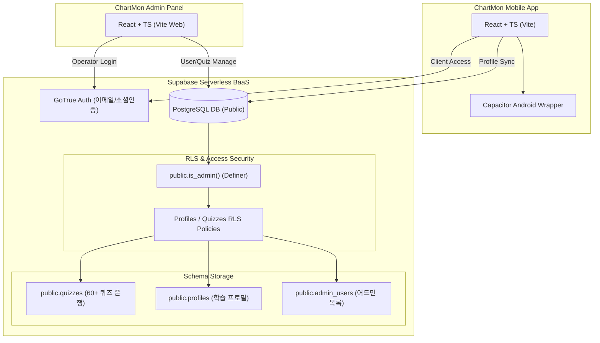

# ChartMon 중간 비즈니스 및 개발 구현 계획서 (Midterm Plan)

본 문서는 **PokerTrainer** 벤치마킹을 바탕으로 설계된 ChartMon(차트몬)의 비즈니스 아이디어, 게이미케이션 및 광고 퍼널 전략과, 현재까지 실제 구축 완료된 모바일 클라이언트, 독립형 어드민 웹 및 Supabase 보안 백엔드 구현 스펙을 종합 정리한 중간 계획서입니다.

---

## 1. 비즈니스 컨셉 및 벤치마킹 분석

### 1) PokerTrainer (pokertrainer.se) 벤치마킹 요약
* **근육 기억(Muscle Memory) 학습**: 단순 암기용 정적 교과서를 넘어, 동적으로 변하는 포커 상황에서 최적의 액션을 반복 훈련하게 하는 시뮬레이션 체육관 구조 채택.
* **지속 가능한 지표 관리**: 레벨(Level), 최고 점수(High Score), 스트릭(Streak)을 통해 유저의 도전 욕구를 극대화하고 리텐션(Retention) 부스팅.
* **ChartMon에 적용**: 정적인 이론 학습 목록을 제거하고 **6대 실전 트레이딩 드릴**을 통한 무한 차트 트레이닝 시스템 구현.

### 2) 비즈니스 및 광고 퍼널 모델 (Duolingo형 게이미케이션)
* **듀오링고형 게이미케이션**: 매일 3문제를 푸는 **데일리 트레이닝 워크아웃**, 경험치(XP) 시스템, 학습 스트릭 유지 보상 및 5단계 트레이딩 티어 배지(모의 투자자 ~ 시장 마스터) 매핑.
* **개인화된 난이도 자동 튜닝 (Personalized Difficulty Customization)**: 마케팅의 핵심 소구점으로 활용하며, 유저의 오답 패턴과 숙련도를 분석하여 맞춤 훈련 문제를 자동 공급 및 생성한다는 점을 메타 광고에 전면 노출.
* **자존심 자극형 마이크로 퀴즈 퍼널**:
  1. 1단계: 상위 5% 돌파 휩소 구별 퀴즈 (광고 소재 클릭 유도).
  2. 2단계: 본인의 차트 실력 자가 진단 (매몰 비용 형성).
  3. 3단계: "당신의 매매 지능은 뇌동매매 등급입니다" 등 자극적 피드백 제공 후 눈높이 맞춤 트레이닝 앱 다운로드 유도.
* **인앱 구독 모델 (Google Play Billing)**:
  - 무료 티어: 매일 3회 퀴즈 및 기초 캔들스틱 이론 공개.
  - 프리미엄 구독 (월 9,900원): 무제한 퀴즈, 맞춤형 오답 노트 자동 재생성, 심화 다이버전스 분석 이론서 및 VIP 멤버십 커뮤니티 입장권 제공.

---

## 2. 시스템 아키텍처

---

## 3. 핵심 앱 구현 현황

### 1) 모바일 클라이언트 (Root Application)
* **차트 드로잉 엔진 (Canvas Visualizer)**: JSON으로 입력받은 시/고/저/종 캔들스틱 데이터를 가로폭에 맞춰 렌더링하고, 수평 지지선, 사선 추세선, 피보나치 채널, 텍스트 레이블 작도 데이터를 오버레이로 매끄럽게 시각화.
* **데일리 트레이닝 & 드릴 워크아웃**:
  - 미완료된 문제 우선으로 무작위 3문항 세션을 공급하여 일일 학습 목표를 달성하게 하는 기능 탑재.
  - 6대 드릴(캔들 패턴, 지지저항, 추세선, 차트패턴, 보조지표, 리스크관리)별 5개 문제 세션 훈련 기능 구현.
* **이론 뷰어 (Theory Reader)**: [docs/trading-theories/](file:///d:/TradingEdu/docs/trading-theories/) 경로 내에 사전 마련된 6대 마크다운 이론 교과서를 앱 내에서 원활히 가독할 수 있도록 컴포넌트 이식.
* **로컬/서버 동기화**: 학습자의 오답 정보와 점수, XP, 스트릭을 로컬스토리지에 실시간 저장하고 Supabase 로그인 시 서버와 양방향 동기화(`upsert`).

### 2) 독립형 어드민 포털 (`/admin`)
* **이메일/비밀번호 보안 로그인**: Supabase Auth와 실시간으로 연동되어 operator 계정으로 로그인 수행.
* **유저 프로필 감시 탭**: 전체 가입자의 레벨, 누적 XP, 연속 학습 스트릭 현황뿐만 아니라 세부 드릴별 개인 숙련도(최고 점수, 도전 횟수) 등을 실시간 모니터링하여 학습 패턴 분석 가능.
* **퀴즈 문제은행 CRUD 탭**:
  - 60개에 달하는 실전 결단형 차트 문제를 확인하고 실시간 추가, 수정, 삭제 가능.
  - 좌표 데이터(JSON) 등의 정합성 유효성을 검사하는 밸리데이터 폼 구현.
  - 리스트 내 문항을 클릭하여 팝업 모달에서 즉각 차트 시각화 및 정오답 피드백 작동 여부를 점검할 수 있는 **원클릭 빠른 검수 모달** 제공.
* **실전 검수기 (Inspector) 탭**: 모바일 기기와 100% 동일한 화면 구조로 퀴즈를 직접 풀어보고 시뮬레이션할 수 있는 검수 인터페이스 구축.

---

## 4. 보안 및 인프라 최적화 조치 사항

### 1) 어드민 권한 격리 및 클라이언트 우회 방지 (Admin Isolation)
> [!IMPORTANT]
> **RLS 자가 승격 취약점 차단**
> * 기존 `profiles` 테이블에 존재하던 `is_admin` 컬럼을 완전히 삭제하여, 클라이언트가 자가 업데이트 정책(`auth.uid() = id`)을 이용해 본인을 어드민으로 승격시키는 취약점을 제거했습니다.
> * 대신 백엔드 전용 격리 테이블인 `public.admin_users`를 신설하고 클라이언트 쓰기 권한을 원천 봉쇄했습니다.
> * RLS 정책 평가 도중 profiles 조회 시 무한 루프가 발생하는 현상을 방지하기 위해 `SECURITY DEFINER` 권한을 적용한 `public.is_admin()` helper 함수를 설계하여 이를 기준으로 `quizzes` 쓰기 권한 및 `profiles` 테이블 전체 조회를 제어합니다.

### 2) 클라이언트 단 하드코딩 패스워드 제거
* 어드민 웹사이트 코드 내부에 하드코딩되어 번들 노출 위험이 매우 높았던 `chartmon123!` 관리자 비밀번호 로직을 완전히 삭제하고 Supabase Auth 실시간 토큰 인증 방식으로 재설계했습니다.

### 3) 환경 변수 유출 방지 (Git Untracking)
* 실수로 리포지토리에 트래킹되어 커밋에 보존되어 있던 `.env` 및 `admin/.env` 파일을 git 히스토리 보존 처리와 함께 완전히 배제(`git rm --cached`)하고 `.gitignore` 규칙을 대폭 강화했습니다.

### 4) 빌드 및 린트 성능 최적화
* `eslint.config.js` 내 ignores 옵션에 모바일 빌드 폴더(`android/**/build/**`), 빌드 캐시 및 디렉토리들을 적절히 설정하여, OOM 오류를 해결하고 정적 분석 수행 시간을 **1.5초** 내외로 최적화했습니다.

---

## 5. 차기 개발 및 서비스 고도화 과제 (Roadmap & Next Focus)

### 1) 기술적 비즈니스 신규 기능 개발
* **실시간 차트 트레이딩 게임 (Real-time Trading Simulation Game)**:
  - **기능**: 유저가 50,000,000 KRW (5천만 원)의 가상 원금을 가지고 시작하여 실시간 가격 변동(1~2초마다 신규 캔들이 우측으로 그려지는 연출)을 보며 매수(Buy/Long), 매도(Sell/Short), 관망(Wait) 결정을 내리는 게임 모드.
  - **목표**: 포지션 진입 후 실시간 PnL(수익률) 변동 및 기계적 손절(Stop Loss)/익절(Take Profit) 작동 프로세스를 훈련하게 하여 극상의 재미와 중독성(리텐션)을 유도합니다.
* **인앱 인터랙티브 용어 사전 (Touch-Hold Glossary Popover)**:
  - **기능**: 퀴즈 및 이론 공부 화면 전반에 나타나는 모든 어려운 트레이딩 전문 용어(예: 휩소, 다이버전스, 불트랩, 골든크로스 등)에 밑줄 또는 색상 표시 처리.
  - **동작**: 유저가 모바일에서 해당 단어를 **터치하고 유지(Touch & Hold)**하거나 웹에서 호버링할 때, 그 즉시 해당 용어의 2줄 요약 설명이 팝업으로 나타나고, 손을 떼면 즉시 사라지는 사용자 친화적 툴팁 인터페이스 구현.
  - **독립 탭**: 하단 탭에 전체 트레이딩 용어를 알파벳/가나다순으로 찾아볼 수 있는 **"용어 사전 (Glossary)"** 독립 메뉴 신설.

### 2) 비즈니스 인프라 셋업
1. **인앱 결제 연동**: Capacitor 빌링 라이브러리(`@capgo/capacitor-in-app-purchase`) 플러그인 이식 및 결제 영수증의 구글 API 검증을 수행할 **Supabase Edge Functions** 개발.
2. **난이도 튜닝 알고리즘**: 유저의 드릴 정답률 점수가 누적됨에 따라, Supabase DB에서 퀴즈 조회 시 해당 난이도 등급에 알맞은 문제를 추출하여 반환하는 동적 매칭 쿼리 완성.
3. **오답 노트 드릴**: DB `profiles.drill_stats` 정보를 기반으로, 틀렸던 문제 코드를 별도 보관 및 리마인드 세션으로 구성해 주는 오답 학습 시스템 구축.
